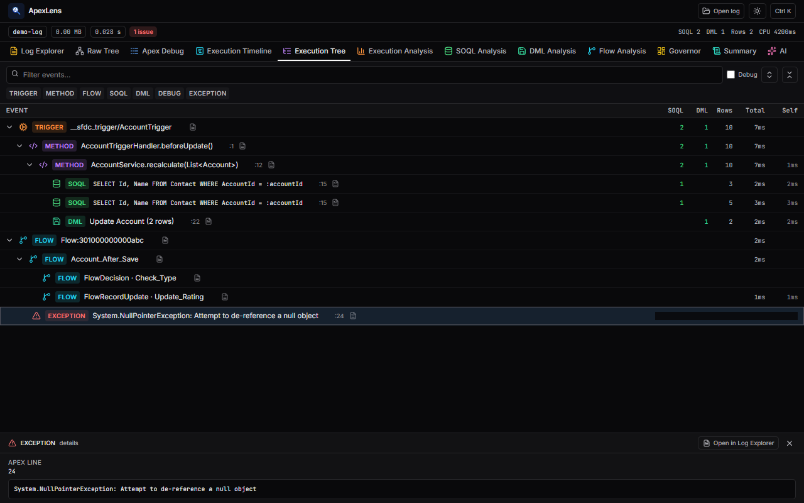
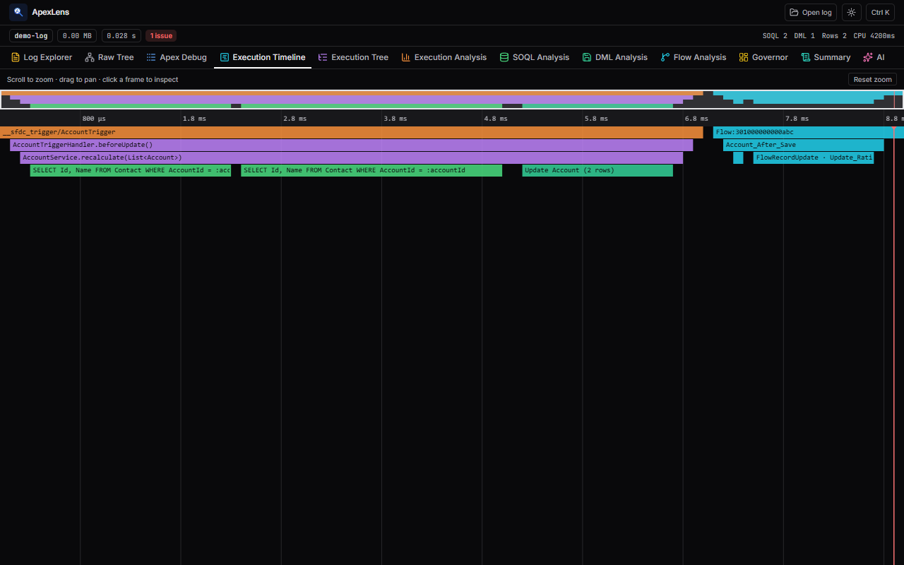

# ApexLens

[](https://github.com/Tanishk04/apexlens/actions/workflows/ci.yml)
[](LICENSE)

A privacy-first Chrome extension (Manifest V3) that turns raw Salesforce debug logs into a
structured, interactive execution model — collapse/expand call tree, flame-chart timeline,
governor-limit dashboard, and SOQL/DML/Flow analysis. All parsing happens locally; no log data
ever leaves the browser. Optional AI diagnosis is bring-your-own-key and fully opt-in.

## Features

- **Execution Tree** — collapsible call tree, multi-type filtering, jump straight to the raw log
  line behind any row.
- **Execution Timeline** — canvas flame chart with bounded pan/zoom and a minimap.
- **Governor Dashboard** — SOQL/DML/CPU/heap usage at a glance.
- **SOQL / DML / Flow Analysis** — sortable, filterable tables.
- **Log Explorer & Raw Tree** — exact raw log text, color-coded by event type, in-app find.
- **AI analysis (BYOK)** — optional, opt-in, guardrailed against speculation and code generation.

<p>
  
  
</p>

## Install

- **Chrome Web Store**: pending review — link will be added here once published.
- **From source**: see [Development](#development) below.

## Stack

- Chrome Manifest V3 · [@crxjs/vite-plugin](https://crxjs.dev)
- React 19 · Vite · TypeScript (strict, `tsc --noEmit` typecheck) · ESLint (flat config)
- Tailwind CSS 4 · Lucide icons
- TanStack Virtual (tree) · Web Worker (parsing)
- Jest + ts-jest (unit tests), @testing-library/react (component tests)

## Development

```bash
npm install
npm run dev         # Vite dev server (HMR)
npm run build       # production build → dist/
npm test            # unit + component tests
npm run typecheck   # tsc --noEmit over the real app source
npm run lint        # eslint
```

### Load the unpacked extension

1. `npm run build`
2. Chrome → `chrome://extensions` → enable **Developer mode**
3. **Load unpacked** → select the `dist/` folder
4. Open a Salesforce Setup ▸ Debug Logs page → click **Analyze** next to a log

## Architecture

```
Salesforce Setup page (content script injects an "Analyze" button per log row)
                    │  chrome.runtime.sendMessage({ logId, domain })
                    ▼
      Background service worker (opens the app as its own tab)
                    │  chrome.tabs.create(chrome.runtime.getURL('src/app/index.html?...'))
                    ▼
   App tab: validate domain ──▶ fetch log body (session cookie) ──▶ Web Worker parser
                    │
    ┌───────────────┬───────────────────────┬───────────────────┬────────────────┐
    ▼               ▼                       ▼                   ▼                ▼
Execution Tree  Timeline (canvas)   Governor Dashboard   SOQL/DML/Flow    AI analysis
```

Module boundaries:
- `src/parser.ts`, `src/events.ts`, `src/logDisplay.ts` — pure log-parsing pipeline, no React/DOM.
- `src/app/utils/` — pure derived-data helpers (tree flattening, analysis, flame layout, find).
- `src/app/theme/eventColors.ts` — single source of truth for category → color, used by every
  view that colors log events (tree rows, raw log, flame chart, filter chips, minimap).
- `src/app/components/` — presentation; talks to `utils`/`ai`, never to `chrome.*` directly.
- `src/ai/` — provider registry, prompt building (with prompt-injection hardening), adapters.
- `src/background/`, `src/content/` — the only two files that touch `chrome.*` extension APIs.

The parser is registry-driven: a single event catalog (`src/events.ts`) maps every Salesforce log
event across all 9 log categories to a node type. Unknown events fall through to a generic node so
new API versions never break parsing.

## Privacy

No telemetry, no uploads, no external calls by default. Logs are parsed and held in-memory in the
extension tab only. Full policy, including exactly what the opt-in AI feature sends and to whom:
[PRIVACY.md](PRIVACY.md).

## Contributing

See [CONTRIBUTING.md](CONTRIBUTING.md) for dev setup, the verification scripts CI runs, and coding
conventions. Please read [CODE_OF_CONDUCT.md](CODE_OF_CONDUCT.md) too. Security issues: see
[SECURITY.md](SECURITY.md) instead of filing a public issue.

## License

[MIT](LICENSE)
